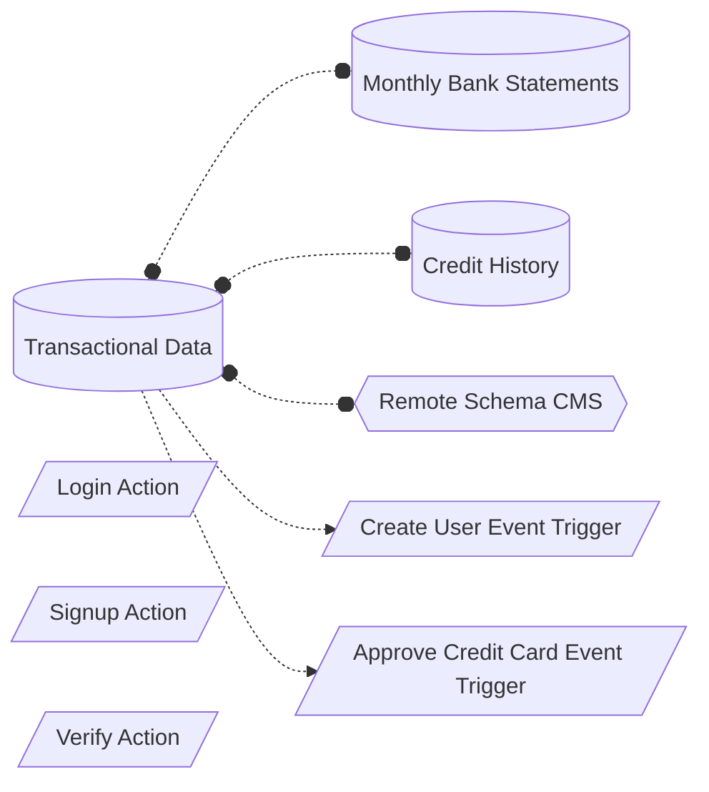

# Defining the goal

## The app structure

In this demo, we are building the backend for a mobile banking application. This includes functionality like transactions, buying financial products, and more.

## We are not building an app

When building with Hasura, it's best to abstract away what the current product implementation is and to think about the product as a data layer. We want to connect all the data and services needed to fully support the mobile banking application, not have our API design be driven by the interface.

Don't worry, when all the joins and permissions are in place, we'll be able to accomplish everything we need.

## So what are we building?

Our data ecosystem for our bank is as follows.

1. We start with conecting our existing data
2. We custom business logic for signup, login, and verify auth functions
3. We enable data flows with event triggers
4. We bring in CMS data from a remote schema

We'll be adding support for our new product offering, applying for credit products (credit cards) in our transactional database.

With all of this data, we'll be able to look at some interesting business use-cases for working with this data and learn about more Hasura features along the way.

But first, we need to [set up our infrastructure](/guide/02-infrastructure/Readme.md)
