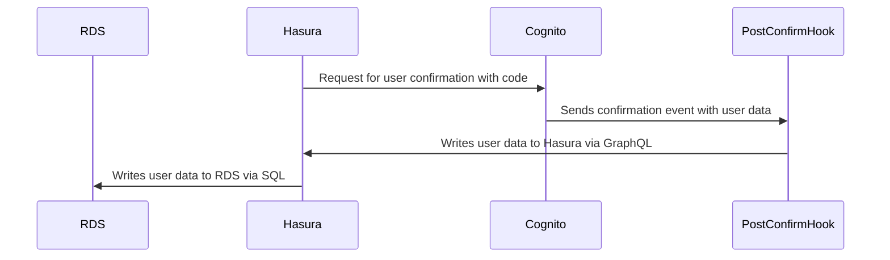
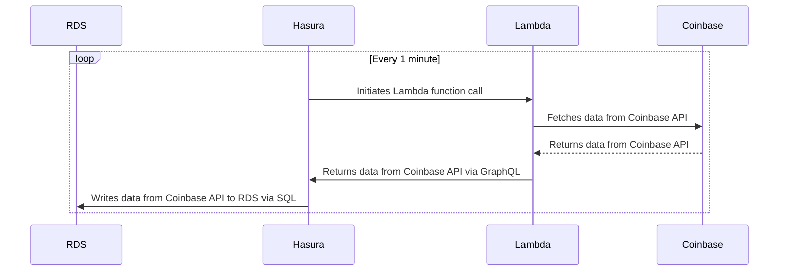
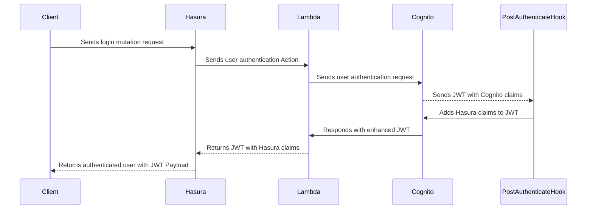

# Setting up the infrastructure

You need to provision two key parts of the infrastructure. An AWS ecosystem of functions and databases, and the Hasura Cloud console.

---

## Setting up AWS

To set up your AWS accounts, you need to go to the following link.

https://dashboard.eventengine.run/login?hash=cba7-1e6c027654-d0

### Looking at the services

1. RDS
2. Athena
3. Cognito
4. Lambda

---

## Set up Hasura Cloud

Signup at https://cloud.hasura.io

### Copying Stack outputs to env vars

Also, add the EVENT_TRIGGER_URL: https://echo-server.hasura.app/api/rest/postify

---

## House Keeping:

1. Seed Cognito users
2. Lock down RDS
3. Add environment variables to lambdas

---

### Cognito hook sequence

---

### Coinbase sequence

---

### Login Flow

### ENV Secrets

AWS_LAMBDA_HOST
RDS_DB_1
RDS_DB_2
HASURA_GRAPHQL_UNAUTHORIZED_ROLE
HASURA_GRAPHQL_JWT_SECRET
EVENT_TRIGGER_BASE: https://echo-server.hasura.app/api/rest/postify

### Dashboard run through

### Console run through

## Now it's time to [connect all the pieces](/guide/03-data-joins/Readme.md)
