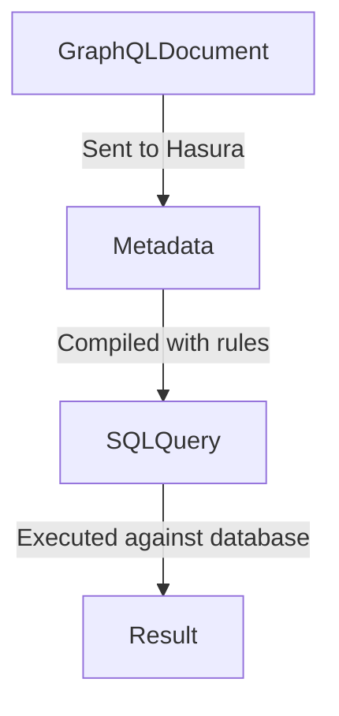
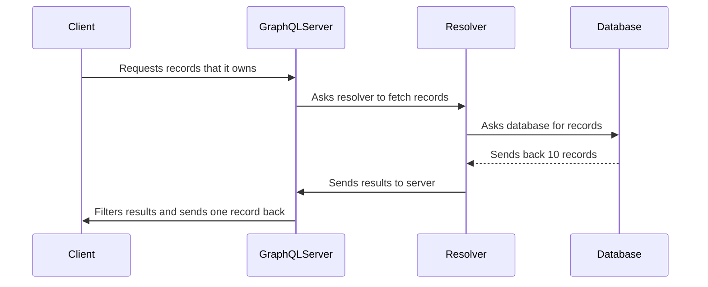
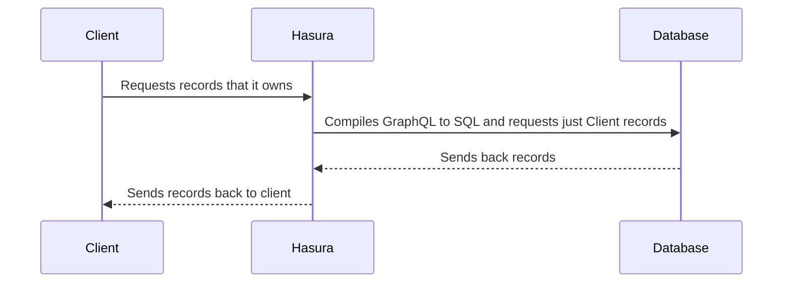

# Look at the data sources


## Database 1

Our primary transactional database lives in RDS.

Steps:

1. Discuss the magic.
2. Look at how Hasura operates.
3. Look at the analyze tab.
4. Apply permissions with predicate pushdown

## How Hasura works



---

## Typical GraphQL Server



---

## Hasura GraphQL



---

## Database 2

Our credit report data from the big three.

## Database 3

Our Crypto DB.

## Database 4

Static file processing with Athena statements.

Steps:

1. Namespace the statements field

## Connecting the data sources

Use the environment variables

## Adding feautures

Beyond this basic data model, we're going to add support for selling Credit Cards to users.

```sql
CREATE TABLE c_application_status_enum (
  value text NOT NULL PRIMARY KEY,
  description text
);

CREATE TABLE credit_products (
  id SERIAL PRIMARY KEY,
  annual_fee DECIMAL(10,2) NOT NULL,
  interest_rate DECIMAL(10,2) NOT NULL
);

CREATE TABLE credit_product_applications (
  id SERIAL PRIMARY KEY,
  user_id INTEGER NOT NULL REFERENCES users(user_id),
  credit_product_id INTEGER NOT NULL REFERENCES credit_products(id),
  date_applied DATE NOT NULL DEFAULT now(),
  status text NOT NULL REFERENCES c_application_status_enum(value) DEFAULT 'PENDING'
);
```

Insert data:

```sql
INSERT INTO c_application_status_enum (value, description) VALUES ('PENDING', 'The application is pending review.');
INSERT INTO c_application_status_enum (value, description) VALUES ('APPROVED', 'The application has been approved.');
INSERT INTO c_application_status_enum (value, description) VALUES ('DENIED', 'The application has been denied.');
INSERT INTO credit_products (annual_fee, interest_rate) VALUES (0.00, 15.99);
INSERT INTO credit_products (annual_fee, interest_rate) VALUES (99.00, 18.99);
INSERT INTO credit_products (annual_fee, interest_rate) VALUES (59.00, 12.99);
INSERT INTO credit_products (annual_fee, interest_rate) VALUES (29.00, 21.99);
INSERT INTO credit_products (annual_fee, interest_rate) VALUES (149.00, 14.99);
```

### Steps

1. Configure Status as an Enum

## Adding Remote Schemas

Now that we've added a product to our mobile banking offering, we want to bring in our CMS data. Since we are a cutting edge bank, of course our CMS is headless and offers a GraphQL API.

We're going to add this remote schema.

https://us-east-1-shared-usea1-02.cdn.hygraph.com/content/clg39oqud10xw01szfm8m5wln/master

You'll need to provide a namespace for remote schemas.

## Ready, and [Actions!](/guide/04-data-flows/Readme.md)
